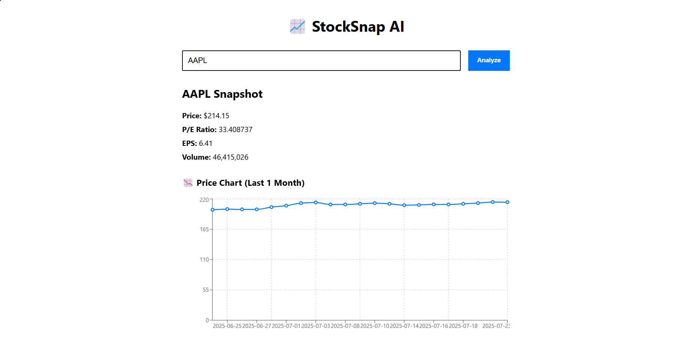

# 📈 StockSnap AI

**StockSnap AI** is a modern web app that lets you analyze any public stock by simply entering its ticker. It fetches real-time market data, renders an interactive chart, and generates a smart AI summary of the stock's performance.

---

## 🚀 Features

- 🔍 Search any stock by its ticker (e.g., `AAPL`, `TSLA`, `MSFT`)
- 📊 Interactive price chart (last 1 month)
- 💬 AI-generated financial summary using Google Gemini
- ⚡ Real-time stock fundamentals (price, P/E ratio, EPS, volume)
- 🌐 Fully deployed frontend

---

## 🖼️ Preview



---

## 🛠 Tech Stack

| Frontend        | Backend       | AI & APIs        | Deployment     |
|-----------------|---------------|------------------|----------------|
| React + TypeScript | FastAPI (Python) | Gemini API (Google AI) | Vercel (Frontend) |
| Recharts         | Axios        |                  | Render (Backend) |

---

## 📦 Installation (Local Dev)

```bash
# 1. Clone the repo
git clone https://github.com/yourusername/stocksnap-ai.git
cd stocksnap-ai

# 2. Install dependencies
npm install

# 3. Run locally
npm run dev
```

---

## 🌍 Live Demo

**[https://stocksnap-ai.vercel.app](https://stocksnap-ai.vercel.app)**

---

## 📄 License

This project is licensed under the [MIT License](LICENSE).

---

## 🙌 Acknowledgments

- Google Gemini API (AI summaries)
- Yahoo Finance for market data
- React & FastAPI communities
